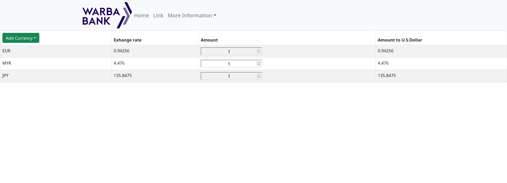

# Exchange Currency Convertor

Inspire by Bank of America website.

## Table of contents

- [Overview](#overview)
  - [The challenge](#the-challenge)
  - [Screenshot](#screenshot)
  - [Link](#links)
- [My process](#my-process)
  - [Built with](#built-with)

## Overview

### The challenge

Users should be able to:

- View a table ON DESKTOP only.
- Select a currency to convert it to USD dollars.
- Add an amount from foreing currency to exchange.

### Screenshot

### Link

- Live Site URL: [https://bank-exchange-chicho.netlify.app/](https://bank-exchange-chicho.netlify.app/)

## My process

### Built with

- Fetch
- Bootstrap
- CSS Grid
- Desktop work-flow
- [React](https://reactjs.org/) - JS library